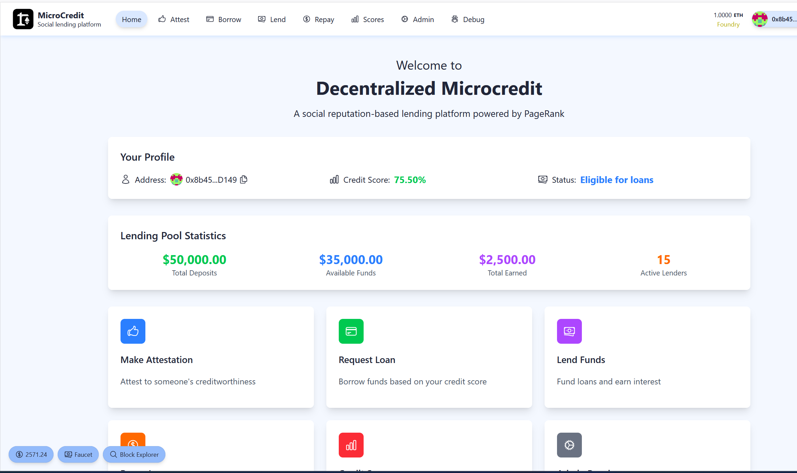

# Decentralized Microcredit System



A decentralized microcredit platform built on Ethereum using social attestations and PageRank-based reputation scoring. This system enables peer-to-peer lending with credit scores calculated through social network analysis.

## 🌟 Features

### Core Functionality
- **Social Attestations**: Users can vouch for borrowers' creditworthiness
- **PageRank Credit Scoring**: Advanced reputation system using network analysis
- **Peer-to-Peer Lending**: Direct lending between users with automated fund allocation
- **Flexible Loan Terms**: Customizable repayment periods with dynamic interest rates
- **Late Fee Management**: Automated late fee calculation and overdue loan tracking

### Smart Contract Features
- **Credit Score Updates**: Oracle-controlled credit score management
- **Lender Pool Management**: Deposit, withdraw, and earn yield from lending
- **Loan Lifecycle Management**: Request, fund, repay, and track loan status
- **Yield Distribution**: Automated interest distribution to lenders with platform fees
- **Attestation Rewards**: Incentivized attestation system with reward calculations

### Frontend Features
- **Dashboard**: Overview of user's lending and borrowing activities
- **Attestation System**: Make and view social attestations
- **Borrowing Interface**: Request loans with preview of terms
- **Lending Interface**: Deposit funds and view available lending opportunities
- **Repayment System**: Repay loans with partial and full payment options
- **Credit Score Viewer**: Search and view credit scores with detailed breakdowns
- **Admin Panel**: Oracle functions for credit score management

## 🏗️ Architecture

### Tech Stack
- **Smart Contracts**: Solidity with OpenZeppelin contracts
- **Frontend**: Next.js 14 with App Router
- **Blockchain**: Foundry for development and testing
- **Web3 Integration**: Wagmi, RainbowKit, and Viem
- **Styling**: Tailwind CSS with DaisyUI
- **Icons**: Heroicons

### Key Components
- **DecentralizedMicrocredit.sol**: Main microcredit smart contract

- **Frontend Pages**: React components for all user interactions
- **Scaffold-ETH Hooks**: Custom hooks for contract interactions

## 🚀 Quick Start

### Prerequisites
- Node.js (>= v20.18.3)
- Yarn package manager
- Git

### Installation

1. **Clone the repository**:
```bash
git clone <repository-url>
cd microcredit-contract
```

2. **Install dependencies**:
```bash
yarn install
```

3. **Start local blockchain**:
```bash
yarn chain
```

4. **Deploy contracts** (in a new terminal):
```bash
yarn deploy
```

5. **Start frontend** (in a new terminal):
```bash
yarn start
```

6. **Visit the application**:
   - Main app: http://localhost:3000
   - Debug contracts: http://localhost:3000/debug

## 📖 Usage Guide

### For Borrowers
1. **Get Attested**: Ask trusted contacts to vouch for your creditworthiness
2. **Check Credit Score**: View your current credit score on the Scores page
3. **Request Loan**: Use the Borrow page to request a loan with desired terms
4. **Repay Loan**: Use the Repay page to make payments before the due date

### For Lenders
1. **Deposit Funds**: Add USDC to the lending pool via the Lend page
2. **Fund Loans**: Automatically participate in loan funding based on available funds
3. **Earn Yield**: Receive interest payments when loans are repaid
4. **Withdraw Funds**: Remove funds from the lending pool when needed

### For Attesters
1. **Make Attestations**: Vouch for borrowers' creditworthiness on the Attest page
2. **Earn Rewards**: Receive rewards when attested borrowers successfully repay loans
3. **Build Reputation**: Your attestations contribute to the overall credit scoring system

### For Admins/Oracles
1. **Update Credit Scores**: Use the Admin panel to update user credit scores
2. **Batch Updates**: Update multiple credit scores at once
3. **Monitor System**: View system statistics and loan status

## 🔧 Development

### Smart Contract Development
- **Contracts**: Located in `packages/foundry/contracts/`
- **Tests**: Located in `packages/foundry/test/`
- **Deployment**: Scripts in `packages/foundry/script/`

### Frontend Development
- **Pages**: Located in `packages/nextjs/app/`
- **Components**: Located in `packages/nextjs/components/`
- **Hooks**: Located in `packages/nextjs/hooks/`

### Testing
```bash
# Run smart contract tests
yarn foundry:test

# Run frontend tests
yarn next:test

# Run type checking
yarn next:check-types

# Run linting
yarn next:lint
```

## Smart Contract Functions

### Core Functions
- `requestLoan(amount, repaymentPeriod)`: Request a new loan
- `fundLoan(loanId)`: Fund a requested loan from the lending pool
- `repayLoan(loanId, amount)`: Repay a loan in full
- `partialRepayLoan(loanId, amount)`: Make a partial loan payment
- `recordAttestation(borrower, weight)`: Make a social attestation

### Lending Functions
- `depositFunds(amount)`: Deposit USDC into the lending pool
- `withdrawFunds(amount)`: Withdraw funds from the lending pool
- `claimYield()`: Claim earned interest from lending

### Credit Score Functions
- `getCreditScore(user)`: Get a user's current credit score
- `updateCreditScore(user, score)`: Update a user's credit score (oracle only)
- `computePageRankScores()`: Trigger PageRank computation

### View Functions
- `getLoan(loanId)`: Get detailed loan information
- `getLenderInfo(lender)`: Get lender's deposit and yield information
- `getPoolInfo()`: Get overall lending pool statistics
- `isLoanOverdue(loanId)`: Check if a loan is overdue
- `calculateLateFees(loanId)`: Calculate late fees for overdue loans

## Key Features Explained

### PageRank Credit Scoring
The system uses a modified PageRank algorithm to calculate credit scores based on:
- Social attestations between users
- Attestation weights and confidence levels
- Network topology and reputation propagation
- Successful loan repayment history

### Dynamic Interest Rates
Interest rates are calculated based on credit scores:
- Higher credit scores = lower interest rates
- Configurable minimum and maximum rates
- Automatic rate calculation for each loan request

### Lending Pool Mechanics
- **Proportional Funding**: Loans are funded proportionally from all available lender funds
- **Yield Distribution**: Interest is distributed to lenders based on their share of the loan
- **Platform Fees**: Small percentage taken from interest for platform maintenance
- **Liquidity Management**: Lenders can deposit and withdraw funds freely

### Social Attestation System
- **Weighted Attestations**: Attesters can assign confidence levels (0-100%)
- **Reward System**: Attesters earn rewards when their attested borrowers repay successfully
- **Reputation Backpropagation**: Successful repayments improve attester reputation
- **Network Effects**: Attestations create a trust network that benefits all participants

## 🔒 Security Features

- **Reentrancy Protection**: All external calls are protected against reentrancy attacks
- **Access Control**: Oracle functions are restricted to authorized addresses
- **Input Validation**: All user inputs are validated for safety
- **Overflow Protection**: Uses SafeMath patterns and proper bounds checking
- **Emergency Controls**: Owner can update critical parameters if needed

## 📈 Future Enhancements

- **Credit Score History**: Track credit score changes over time
- **Advanced Analytics**: Dashboard with lending/borrowing analytics
- **Mobile App**: React Native mobile application
- **Cross-Chain Support**: Multi-chain deployment
- **DAO Governance**: Community governance for platform parameters
- **Insurance Pool**: Optional insurance for lenders against defaults

## Contributing

1. Fork the repository
2. Create a feature branch
3. Make your changes
4. Add tests for new functionality
5. Ensure all tests pass
6. Submit a pull request

## License

This project is licensed under the MIT License - see the LICENSE file for details.

## Support

For support and questions:
- Check the documentation in the code comments
- Review the test files for usage examples
- Open an issue on GitHub for bugs or feature requests

---

**Built with ❤️ using Scaffold-ETH 2**
