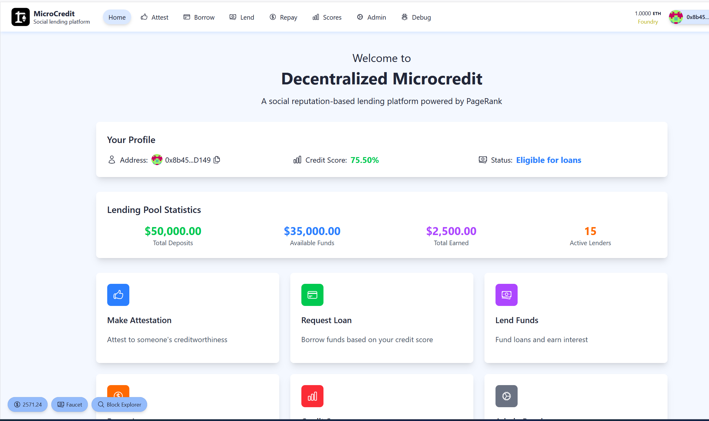

# Decentralized Microcredit Platform



## Introduction

This project prototypes a full-stack **peer-to-peer micro-lending application** on an EVM network.  
Lenders earn yield on USDC deposits while borrowers obtain collateral-free loans backed by their **social reputation**, not a traditional credit history.

Key ideas for crypto-aware readers:

1. **Reputation via PageRank**: users create weighted social attestations; an on-chain PageRank algorithm turns the network graph into a 0–100 credit score that caps how much each borrower can draw.
2. **Fixed-rate loans**: the APR is the Effective Federal Funds Rate (EFFR) plus a configurable risk premium, fixed when the loan is created.
3. **Single liquidity pool**: deposits are pooled; liquidity is reserved when a loan is approved and released when repaid, balancing lender withdrawals with borrower demand.
4. **Gasless by default**: every user action can be signed as an EIP-712 message (or an EIP-2612 permit) and submitted by a relayer, so borrowers never need ETH.

---

## Feature Highlights

• Social attestations and PageRank-based credit scoring (all on-chain)  
• Unified lending pool with utilisation cap, liquidity buffer and a FIFO withdrawal queue  
• Meta-transactions for borrowing, repaying, depositing, withdrawing and attesting  
• Admin panel to update EFFR, risk premium and other parameters  
• Next.js 15 front-end with live pool statistics and user dashboards

---

## Architecture & Tech Stack

| Layer           | Technology |
| --------------- | ---------- |
| Smart contracts | Solidity 0.8.x, Foundry, OpenZeppelin |
| Front-end       | Next.js 15 App Router, Tailwind CSS, daisyUI |
| Wallet / Web3   | Wagmi, RainbowKit, Viem |
| Local dev       | Anvil, Forge scripts, Playwright (demo) |

```
packages/foundry/
  contracts/   DecentralizedMicrocredit.sol, PageRank.sol, MockUSDC.sol
  script/      Deploy.s.sol (local deploy + demo seed), VerifyAll.s.sol, UpdateOracle.s.sol
  scripts-js/  `yarn deploy` and keystore helpers, ABI generator
  scripts-py/  NetworkX PageRank baseline used by the Solidity tests
  test/        Forge tests (shared fixture in test/utils/)
packages/nextjs/
  app/         pages; app/api/meta/* are the gasless relayer routes
  utils/       microcredit.ts (deployment constants), eip712.ts (typed data)
scripts/       start-anvil.sh, demo.sh, restart.sh, demo/ (Playwright walkthrough)
lib/           OpenZeppelin submodule (forge-std is vendored inside it)
```

---

## Quick Start (local sandbox)

Prerequisites: `git`, `node >=20.18.3`, `yarn`, and Foundry (`curl -L https://foundry.paradigm.xyz | bash`).

1. **Clone & install**
```bash
git clone --recurse-submodules <repository-url>
cd microcredit-contract
yarn install
```
Already cloned without submodules? Run `git submodule update --init --recursive`.

2. **Run a local chain**
```bash
yarn chain
```
3. **Deploy contracts & seed demo users**
```bash
yarn deploy
```
This deploys MockUSDC and `DecentralizedMicrocredit`, seeds a 10,000 USDC pool and the demo personas, and regenerates `packages/nextjs/contracts/deployedContracts.ts`.

4. **Launch the front-end**
```bash
yarn start
```
Visit http://localhost:3000

Or run `yarn demo` to do all of the above and play the scripted walkthrough in a browser (see [DEMO.md](DEMO.md)). `yarn demo --manual` stops after starting the servers.

### Environment variables
The front-end reads contract addresses and ABIs from `packages/nextjs/contracts/deployedContracts.ts`. Optional overrides go in `packages/nextjs/.env.local`:
```env
NEXT_PUBLIC_DEMO_WALLET=true               # see "Wallet modes" below
NEXT_PUBLIC_ALCHEMY_API_KEY=<key>
NEXT_PUBLIC_WALLET_CONNECT_PROJECT_ID=<id>
# Server-side relayer used by app/api/meta/*
RELAYER_PRIVATE_KEY=<key>                  # optional on Anvil: the first unlocked account pays gas
RPC_URL=<url>                              # non-local chains (LOCAL_RPC_URL overrides localhost:8545)
```

---

## Wallet modes

### Normal mode (default)
The app uses the browser's injected wallet (MetaMask, Rabby, Coinbase Wallet) or the built-in burner wallet for local development.  No extra configuration needed.

```
# packages/nextjs/.env.local: omit this line entirely, or set it to false
NEXT_PUBLIC_DEMO_WALLET=false
```

### Demo wallet mode
A fake `window.ethereum` provider is injected that proxies all signing to the local Anvil node (which auto-signs with its unlocked accounts). A **DEMO** badge and a persona dropdown appear in the header so you can instantly switch between the seeded personas: **Alexis** (admin), **Avery** (attester) and **Brighton** (borrower), without touching MetaMask or triggering any wallet pop-ups. `yarn demo` turns this on automatically.

**Enable:**
```
# packages/nextjs/.env.local
NEXT_PUBLIC_DEMO_WALLET=true
```
Then restart the dev server (`yarn start`). `NEXT_PUBLIC_*` variables are baked in at build time.

**Disable / return to normal MetaMask:**
```
# packages/nextjs/.env.local
NEXT_PUBLIC_DEMO_WALLET=false   # or delete the line
```
Restart the dev server. MetaMask and all real wallet paths are completely unchanged when the flag is off.

> **Note:** Demo wallet mode requires a running Anvil node (`yarn chain`). The provider proxies every RPC call to `http://127.0.0.1:8545`.

---

## Interest and Repayment

The contract stores two basis-point values:
- `effrRate`: Effective Federal Funds Rate, intended to come from the Pyth Network oracle in production (set manually during local testing).
- `riskPremium`: additional spread to cover platform risk.

The borrower's APR is `effrRate + riskPremium`, fixed when the loan is created. Simple interest accrues on the principal from origination, with none during the first 24 hours. Partial repayments reduce the outstanding balance, a repayment never pulls more than is owed, and balances under one cent are forgiven when the loan closes.

## User Guides

### Borrowers
1. Ask contacts for attestations to raise your credit score.  
2. Check the *Scores* page for your current score and max loan amount.  
3. Submit a loan request on the *Borrower* page; the UI previews repayments.  
4. Repay in full or in part from the *Borrower* page. Repayments are gasless: you sign one USDC permit.

### Lenders
1. Deposit USDC through the *Lend* page.  
2. Your funds are allocated automatically when loans are approved.  
3. Withdraw principal whenever sufficient liquidity is available; requests that cannot be paid immediately are queued and filled as liquidity returns.

### Attesters
1. Create an attestation for a borrower, choosing a confidence weight. Re-attesting updates the weight.  
2. The contract computes each attester's weight-proportional share of a reward pot (`computeAttesterReward`); automatic payouts are not implemented yet.

### Oracle / Admin
1. PageRank is recomputed on-chain after every attestation (demo only); the admin page can also trigger it.  
2. Update `effrRate`, `riskPremium`, `maxLoanAmount`, the utilisation cap and liquidity limits as needed.  
3. Monitor pool metrics and reserved liquidity.

---

## Development

• Smart-contract sources: `packages/foundry/contracts/`  
• Tests: `packages/foundry/test/`  
• Front-end code: `packages/nextjs/`  

Common tasks:
```bash
yarn foundry:test                          # Forge tests
yarn foundry:lint                          # forge fmt --check + prettier on scripts-js
yarn next:lint && yarn next:check-types    # front-end lint and types
yarn next:build                            # production build
yarn restart                               # restart chain + app and redeploy (flags in scripts/restart.sh)
```

---

## Contributing
See `CONTRIBUTING.md` for guidelines.  Pull requests are welcome.

---

© 2026 · Licensed under the MIT License
