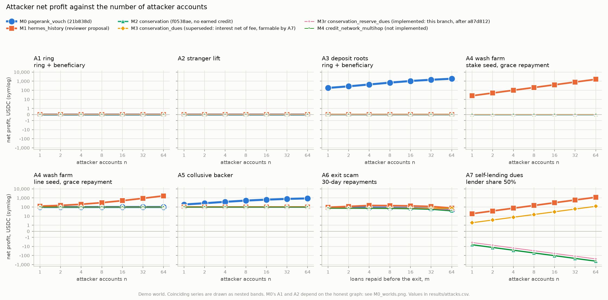

# Sybil simulation: credit mechanisms under adversarial accounts

This is a reproducible comparison of six ways to give collateral-free credit in the lending pool,
tested against attackers who can create any number of accounts for free. Each mechanism is a small
state machine that uses the contract's own integer arithmetic (micro-USDC, floor division, `mulDiv`)
wherever a contract formula exists. The M2 tests reproduce the Forge tests' numbers exactly.

```bash
python3 -m unittest discover analysis/sybil_sim   # 53 tests, about 1 s
python3 analysis/sybil_sim/run.py                 # all experiments, about 8 s
```

Requirements: Python 3.11 with numpy, matplotlib and networkx. The runs are deterministic. The only
randomness is the M0 "community" world, which uses a fixed seed.

| File | Contents |
| --- | --- |
| `mechanisms.py` | the shared pool, loans and first-loss reserve (`Protocol`), and the mechanisms M0, M1, M2, M3, M3r, M4, plus the proposal M3e |
| `attacks.py` | the honest worlds, the attacks A1 to A7 and the M3r residual case (`reserve_drain`) with its closed form, the honest scenarios H1 and H2, and the `Harness` that settles who gained and who lost |
| `run.py` | runs the full grid, checks the accounting and every closed form, writes `results/` and `figures/` |
| `test_mechanisms.py` | cross-checks against `SybilResistance.t.sol`, `LoanLifecycle.t.sol` and `PageRankVerification.t.sol` (21b838d), the reserve, and properties of every attack |
| `results/attacks.csv` | every (mechanism, attack, variant, n) run, with the full ledger |
| `results/m3r_reserve_drain.csv` | the M3r residual case: attack, counterfactual, gain and closed form, for both routes, plus M3e |
| `results/m0_worlds.csv`, `a7_sensitivity.csv`, `honest_h1_backing.csv`, `honest_h2_history.csv` | the sensitivity runs and the honest scenarios |
| `results/summary.md` | every table below, regenerated by `run.py` |
| `figures/attacks_overview.png` | profit against n for each attack (one panel per attack, one line per mechanism) |
| `figures/M3r_reserve_drain.png`, `A7_sensitivity.png`, `M0_worlds.png`, `H2_history.png`, `A*_*.png` | the residual case, the A7 sensitivity grid, M0 by honest world, history credit over time, and each attack with all its variants |

## Mechanisms

All six share one pool:

- ERC4626-style shares with the contract's virtual offset;
- APR 9.33% (EFFR 433 bps + premium 500 bps), simple interest on the original principal, nothing
  in the first 24 hours;
- repayment pays interest first and closes the loan below one cent;
- of each interest payment, a **10% protocol fee** and a **30% reserve share**. The deploy script
  sets 30% and a fee of 0; A7 and the residual case vary both;
- default allowed 30 days after the due date;
- `maxLoanAmount` = 100 USDC.

The first-loss reserve is modelled as the junior claim of this branch. Its cash stays in
`lenderCash` and is lendable; `totalAssets = lenderCash + totalLentOut − reserve`. A default
reduces the reserve before lenders' shares, without moving cash. `fundReserve` adds to both
`lenderCash` and the reserve; `releaseReserve` hands reserve to lenders' shares.

Lines (score × `maxLoanAmount`) are granted directly. Below, G is granted credit, c is credit
committed to backing, o is open principal, I is interest, f the fee share and r the reserve share.

| | Mechanism | Status | Limit | Default charges |
| --- | --- | --- | --- | --- |
| M0 | `pagerank_vouch` | 21b838d | `maxLoan × score`, with score = override, else `x/(x+100)` and `x = 1000·PR/maxPR`. PR is an integer port of `PageRank.sol`: α 0.85, start uniform, stop when the L1 change < 100·N/100,000. Personalisation = override (in SCALE units) or `min(deposit, 100 USDC)` + 100 USDC if KYC'd, all in micro-USDC; uniform when the total is 0. Vouches are free. PageRank is recomputed on attestations only | nothing: the old contract had no default state |
| M1 | `hermes_history` | reviewer proposal | M2, with `G = min(100, line + 0.25·Σ principal of fully repaid loans) − creditLoss` | as M2 |
| M2 | `conservation` | f0538ae, no earned credit | `max(0, G − c) + Σ_in (secured + unsecured·min(1, max(0, G_backer − o_backer)/c_backer))`, with `G = line − creditLoss` (0 after an own default). Backing commits free credit `min(G − c, available)` first, then free stake. Received backing cannot be passed on. Cuts are refused below what the borrower owes | secured backing pro rata (stake slashed to lenders), then unsecured pro rata (`creditLoss`). The reserve absorbs the rest before lenders. Remaining backing is released once the borrower has no open loans |
| M3 | `conservation_dues` | **superseded:** interest net of fee, farmable by A7 (c52610a) | M2, with `G = line + duesPaid − creditLoss` and `duesPaid += I − fee` | as M2 |
| **M3r** | `conservation_reserve_dues` | **implemented:** this branch, after a87d812 | M2, with `G = line + duesPaid − creditLoss` and `duesPaid += toReserve` (= r·I) | as M2 |
| M4 | `credit_network_multihop` | not implemented | max-flow from every account's source (`line − creditLoss` + stake) to the borrower, over trust lines u→v of any length. Declaring a line is free and commits nothing. A loan reserves one flow decomposition of its principal (credit first, then stake, at each source) | each path's share of the unpaid principal is destroyed: the source's stake is slashed first, then its credit is burned, and every edge on the path loses that capacity |
| (M3e) | `earmarked_reserve_dues` | proposal, residual case only | M3r, but a default may draw on the reserve, and the owner may release it, only beyond `min(duesPaid, open principal)` of every other non-defaulted account | as M3r |

**Not modelled:**

- the withdrawal queue;
- the separate request and disburse steps (every loan is `borrowAndDisburseMeta`);
- the oracle's issuance budget and staleness (lines are fixed);
- impairment (c51a9f5). The contract subtracts `max(totalImpaired, reserve)`; with no impairment
  this is the reserve. No attacker here exits as a lender after a due date.

The utilisation cap and liquidity buffer are enforced, but they never bind, because the honest
lender deposits 1,000,000 USDC. M0 runs on today's share pool. The old pool paid deposits back at
par, which only makes A3 easier.

**Senior versus junior reserve.** Before this branch, the reserve was held outside `lenderCash` and
paid into it on default. Modelling the reserve as a junior claim changes **no number**. The whole
attack grid was run under both models, with every attack, all six mechanisms,
n ∈ {1, 4, 64} and fee/reserve ∈ {10%/0, 0/30%, 10%/30%, 0/80%}: 948 runs, and no output field
differs. Both models subtract the reserve from what lenders' shares own in the same way. Only
liquidity differs (reserve cash is now lendable), and the deep pool never binds.

## Honest world and attacks

The **demo world** is the deploy script's credit. Avery holds a 92 USDC line and backs Brighton
with 50, and Brighton holds 25 of his own (at 21b838d Brighton had no override, so in M0 his credit
is Avery's vouch). For M0 two more worlds are run (see the M0 table below):

- **unrooted:** no honest attestation, so the uniform fallback applies;
- **community:** a seeded random graph of 5 lenders who deposit 100 USDC and vouch for 3 members
  each, and 20 members who vouch for each other with probability 0.1.

Attacker accounts start empty. The attacker brings in USDC whenever it must pay interest, stake or
deposit. Every loan the attacker does not repay is marked defaulted as early as the contract
allows. Before that, the attacker withdraws any lender position, while those loans still count at
par.

| | Attack (n = 1, 2, 4, ..., 64) |
| --- | --- |
| A1 | n fresh accounts back each other in a ring and all back one beneficiary; everyone borrows the maximum and defaults. Variant **pure ring**: no beneficiary |
| A2 | two fresh, unrooted accounts back each of n fresh strangers; all borrow the maximum and default |
| A3 | n accounts deposit 100 USDC each as lenders (M0 roots), then ring and beneficiary as in A1, then withdraw the deposits, borrow and default. M0 borrows on scores computed while the deposits were in. Variant **pure ring** |
| A4 | one seed, either a 100 USDC **stake** or an account with a 100 USDC **line**. For i = 1..n: the seed backs fresh account i with everything it has, i borrows its maximum and repays inside the grace period (23 h) or after **30 days**, and the backing is withdrawn and reused. Finally every account borrows its own credit and defaults, and a stake seed is unstaked. Variant **4 cycles**: four loans per account, which is what M1 needs to reach its ceiling. (M0 has no stake, so the stake seed is n/a) |
| A5 | an account with a legitimate 100 USDC line splits its backing over n of its own accounts; everyone borrows and defaults |
| A6 | Brighton turns: he repays **m = n** loans of his full available amount (30-day, or grace), then borrows everything and defaults. Avery is the honest backer at risk |
| A7 | the attacker also owns 50% of the lending pool. A stake backs n fresh accounts with 100 USDC each; each borrows it for a year and repays 9.33 interest; each then borrows the credit its history earned. The attacker withdraws its lender position while those loans are current, and they default |
| A7 drain | the residual case for M3r: A7, but between the dues and the attacker's exit the reserve shrinks by a factor `drain` of the farm's contribution, through other borrowers' defaults or `releaseReserve`. It runs against a counterfactual of the same lender without the farm |

**Ledger.** `net_profit` is the change in the attacker's wealth: wallets + stake + lender shares,
less the capital it brought in. It equals `extracted − interest_paid − stake_lost + lender_pnl`,
where `extracted` is principal received and never repaid. The CSVs also report
`honest_lender_loss` (honest lenders' share value), `honest_stake_lost`, `honest_credit_burned`
(an honest backer's `creditLoss`), `honest_capacity_change` (the change in honest accounts' limits),
`protocol_fees` and `reserve_change`. `run.py` asserts that the two sides balance:
attacker + honest lenders + honest accounts + fees + reserve = 0, within 1e-5 USDC of share
rounding.

## Results



The table shows attacker net profit in USDC at n = 1 and n = 64, in the demo world (fee 10%,
reserve 30%). M3 is superseded; M3r is the implemented rule.

| Attack | Variant | M0 n=1 | M0 n=64 | M1 n=1 | M1 n=64 | M2 n=1 | M2 n=64 | M3 n=1 | M3 n=64 | M3r n=1 | M3r n=64 | M4 n=1 | M4 n=64 |
| --- | --- | ---: | ---: | ---: | ---: | ---: | ---: | ---: | ---: | ---: | ---: | ---: | ---: |
| A1 ring | ring + beneficiary | 0.00 | 0.00 | 0.00 | 0.00 | 0.00 | 0.00 | 0.00 | 0.00 | 0.00 | 0.00 | 0.00 | 0.00 |
| A1 ring | pure ring | 0.00 | 304.76 | 0.00 | 0.00 | 0.00 | 0.00 | 0.00 | 0.00 | 0.00 | 0.00 | 0.00 | 0.00 |
| A2 stranger lift | - | 0.00 | 0.00 | 0.00 | 0.00 | 0.00 | 0.00 | 0.00 | 0.00 | 0.00 | 0.00 | 0.00 | 0.00 |
| A3 deposit roots | ring + beneficiary | 180.40 | 1,853.23 | 0.00 | 0.00 | 0.00 | 0.00 | 0.00 | 0.00 | 0.00 | 0.00 | 0.00 | 0.00 |
| A3 deposit roots | pure ring | 0.00 | 5,818.18 | 0.00 | 0.00 | 0.00 | 0.00 | 0.00 | 0.00 | 0.00 | 0.00 | 0.00 | 0.00 |
| A4 wash farm | stake seed, grace repayment | n/a | n/a | 25.00 | 1,600.00 | 0.00 | 0.00 | 0.00 | 0.00 | 0.00 | 0.00 | 0.00 | 0.00 |
| A4 wash farm | stake seed, 30-day repayment | n/a | n/a | 24.23 | 1,550.92 | -0.77 | -49.08 | -0.08 | -4.91 | -0.54 | -34.35 | -0.77 | -49.08 |
| A4 wash farm | line seed, grace repayment | 100.00 | 100.00 | 125.00 | 1,700.00 | 100.00 | 100.00 | 100.00 | 100.00 | 100.00 | 100.00 | 100.00 | 100.00 |
| A4 wash farm | line seed, 30-day repayment | 99.31 | 56.09 | 124.23 | 1,650.92 | 99.23 | 50.92 | 99.92 | 95.09 | 99.46 | 65.65 | 99.23 | 50.92 |
| A4 wash farm | stake seed, grace repayment, 4 cycles | n/a | n/a | 100.00 | 6,400.00 | 0.00 | 0.00 | 0.00 | 0.00 | 0.00 | 0.00 | 0.00 | 0.00 |
| A4 wash farm | stake seed, 30-day repayment, 4 cycles | n/a | n/a | 95.58 | 6,117.03 | -3.07 | -196.31 | -0.31 | -19.84 | -2.15 | -137.89 | -3.07 | -196.31 |
| A5 collusive backer | - | 189.50 | 885.96 | 100.00 | 100.00 | 100.00 | 100.00 | 100.00 | 100.00 | 100.00 | 100.00 | 100.00 | 100.00 |
| A6 exit scam (n = m loans) | 30-day repayments | 88.80 | 45.57 | 93.17 | 77.67 | 74.42 | 38.19 | 74.94 | 70.39 | 74.60 | 47.27 | 74.42 | 38.19 |
| A6 exit scam (n = m loans) | grace repayments | 89.48 | 89.48 | 93.75 | 150.00 | 75.00 | 75.00 | 75.00 | 75.00 | 75.00 | 75.00 | 75.00 | 75.00 |
| A7 self-lending dues | lender share 50% | n/a | n/a | 18.47 | 1,182.02 | -6.53 | -417.98 | **1.87** | **119.42** | -3.73 | -238.85 | -6.53 | -417.98 |

The marginal profit per extra account, (p(64) − p(32))/32, is in `results/summary.md`:

- exactly 25.00 for M1 in A4 (100.00 with 4 cycles);
- 90.91 for M0 in A3 (pure ring);
- 1.87 for M3 in A7;
- ≤ 0 for M2, M3r and M4 in every attack.

**M0 by honest world**, attacker net profit at n = 1 / 8 / 64 ([figure](figures/M0_worlds.png)):

| Attack | Variant | demo | unrooted | community |
| --- | --- | ---: | ---: | ---: |
| A1 ring | ring + beneficiary | 0.0 / 0.0 / 0.0 | 175.3 / 662.3 / 1,819.4 | 0.0 / 19.4 / 24.8 |
| A1 ring | pure ring | 0.0 / 38.1 / 304.8 | 0.0 / 727.3 / 5,818.2 | 0.0 / 402.0 / 2,046.3 |
| A2 stranger lift | - | 0.0 / 0.0 / 0.0 | 248.3 / 905.6 / 5,999.5 | 0.0 / 0.0 / 0.0 |
| A3 deposit roots | ring + beneficiary | 180.4 / 688.4 / 1,853.2 | 180.4 / 688.4 / 1,853.2 | 169.9 / 690.9 / 1,853.2 |
| A3 deposit roots | pure ring | 0.0 / 727.3 / 5,818.2 | 0.0 / 727.3 / 5,818.2 | 0.0 / 727.3 / 5,567.7 |
| A5 collusive backer | - | 189.5 / 509.8 / 886.0 | 189.5 / 509.8 / 886.0 | 104.8 / 100.0 / 100.0 |

**Honest outcomes.** In H1, Avery (line 92) backs Brighton (own line 25) with 50:

| | Brighton's limit | Avery's limit | Avery's limit after Brighton draws 50 | Sum |
| --- | ---: | ---: | ---: | ---: |
| M0 | 89.48 | 92.00 | 92.00 | 181.48 |
| M1, M2, M3, M3r | 75.00 | 42.00 | 42.00 | 117.00 |
| M4 | 75.00 | 92.00 | 42.00 | 167.00 |

In H2, an honest borrower repays twelve 30-day loans of 50 USDC (4.60 USDC of interest in total).
Her own credit after the year ([figure](figures/H2_history.png)):

| | Starting from her own 50 line | Starting from nothing, with 50 of someone's backing |
| --- | ---: | ---: |
| M1 | 100.00 (ceiling reached in month 4) | 100.00 (month 8) |
| M2, M4 | 50.00 | 0.00 |
| M3 (superseded) | 54.14 | 4.14 |
| M3r (implemented) | 51.38 | 1.38 |

## Findings

### 1. M3 can be farmed by an attacker who is also a lender (A7). Superseded by M3r.

M3 credits dues of (1 − f)·I, but an attacker that owns a share s of the pool earns
s·(1 − f − r)·I of every interest payment back through the share price. It exits as a lender while
the dues-funded loans are still current, and the default then falls on the lenders who stay.
Profit per account is

    I·(s·(1 − f − r) − f)

which is positive whenever s > f/(1 − f − r). Some examples:

- any lender share at fee 0 (the deploy script's fee);
- s = 50%, fee 10%, reserve 30%: 1.87 per 100 USDC-year (119 at n = 64);
- the same at reserve 0: 3.27 per 100 USDC-year (209 at n = 64).

Impairment (c51a9f5) does not stop it, because the attacker leaves before the due date.

**M3r**, now implemented, credits only the reserve share. It yields
`I·(r − 1 + s·(1 − f − r)) < 0` for every s (−3.73 per account at s = 50%), and honest lenders
gain, as long as the reserve that share went into is still there when the dues default. Finding 2
covers what happens when it is not.

### 2. M3r residual case: the farm's reserve contribution reaches lenders before its dues default

Let c be the part of the farm's reserve contribution n·r·I that reaches lenders' shares while the
attacker is still a lender. It gets there either through other borrowers' unrecovered defaults
beyond the earlier reserve R0, or through `releaseReserve`:
`c = min(n·r·I, max(0, L − R0))`, with L the reserve drained.

Compared with the same lender doing nothing (the counterfactual):

    farm gain              = n·I·(r − 1 + s·(1 − f − r)) + s·c
    honest lenders' extra loss = farm gain + f·n·I

The reserve itself ends the same in both runs. With the reserve fully drained (c = n·r·I), the
gain is **n·I·(r − 1 + s·(1 − f))**, which confirms your estimate. It is positive iff
**s > (1 − r)/(1 − f)**, which requires r > f. The simulation matches both formulas to 1e-6 over
256 grid points (512 runs): both routes, four fee/reserve settings, eight lender shares, and drains
of 0, 0.5, 1 and 2. The tests also cover an earlier reserve R0 > 0. The per-account gain is shown below
([figure](figures/M3r_reserve_drain.png)):

| Setting | s* | s = 50% | s = 75% | s = 90% | s = 95% |
| --- | ---: | ---: | ---: | ---: | ---: |
| deployed: fee 0, reserve 30% | 70.0% | −1.87 | 0.47 | 1.87 | 2.33 |
| fee 10%, reserve 30% | 77.8% | −2.33 | −0.23 | 1.03 | 1.45 |
| fee 0, reserve 55% (calibration's full recommendation) | 45.0% | 0.47 | 2.80 | 4.20 | 4.67 |
| fee 0, reserve 80% (`MAX_RESERVE_BPS`) | 20.0% | 2.80 | 5.13 | 6.53 | 7.00 |

So the gain can be positive. It needs all four of the following:

1. **A pool share above s\*.** At the deployed 30% reserve this is a dominant lender (70%). Every
   increase in the reserve share lowers s\*.
2. **A drain inside the window.** The reserve must lose at least R0 + n·r·I between the farm's
   interest payments and its default. With partial drain the gain is interpolated, and at zero
   drain it is never positive.
3. **For the defaults route, a stressed pool.** The gain is a loss transfer. In absolute terms the
   attacker still loses: n·I·(r − 1 + s(1 − f − r)) − s·max(0, L − R0 − n·r·I) < 0 (−0.65 per
   account at s = 90% against −2.52 without the farm). Farming only moves part of a loss the
   attacker would take as a lender onto honest lenders. A lender that can see the defaults coming
   and can exit does better by exiting (0).
4. **For the release route, an owner release.** Here the gain is absolute. With R0 = 0 and the
   farm's contribution released, the attacker makes n·I·(r − 1 + s(1 − f)), for example +1.87 per
   account at s = 90% under the deployed parameters. The farm's own contribution inflates the
   reserve, and that may itself prompt a release.

   **Closed on-chain in ce99679:** `releaseReserve` now keeps `max(totalImpaired, totalDuesPaid)`
   in the reserve, where `totalDuesPaid` is every dues payment ever made, so reserve funded by dues
   can never be released and c = 0 on this route. Only the defaults route (a loss transfer under
   stress, item 3) remains, tracked as CI-21.

In both routes the gain per account is bounded by I·(r − 1 + s(1 − f)) < r·I = 2.80 per
100 USDC-year at r = 30%, and it scales with stake × time, not with n alone.

**Mitigation, verified:** earmark the reserve behind dues in use (M3e). A default may draw on the
reserve, and a release may take it, only beyond `min(duesPaid, open principal)` of every other
non-defaulted account. Then c = 0 on both routes. The farm gain is
n·I·(r − 1 + s(1 − f − r)) < 0 for every s < 1 (largest over the grid: −0.093 per account, at
s = 95% and r = 80%), and honest lenders gain. The cost is that this part of the reserve no longer
cushions other borrowers' defaults. A cruder alternative is to never release reserve while
dues-funded principal is open.

### 3. M0 depends on topology and on the honest graph, and three implementation artefacts drive it

- With the specified A1 topology, growth is sublinear, about n^0.5 at large n. A **pure ring** is
  exactly linear: 90.909 per account (5,818 at n = 64), whether through $100 deposits that are
  then withdrawn (A3, any world) or through the uniform fallback (unrooted world).
- **Early stopping.** The on-chain iteration stops once the L1 change is below 100·N (in PR_SCALE
  units). A ring with no inflow therefore keeps residual mass: 4.76 per account in the demo graph
  and about 32 in the community graph (2,046 at n = 64). Exact PageRank gives that ring 0.
- **Unit mismatch.** Overrides enter the personalisation in SCALE units and deposits in
  micro-USDC, so a 100 USDC deposit outweighs a 100% admin override a hundredfold. In A3 this
  takes Brighton's limit from 89.48 to 0.

### 4. M1 is as broken as expected

One recyclable 100 USDC stake yields exactly 25.00 per fresh account at zero cost (1,600 at
n = 64), and 100.00 per account with four grace-period cycles (6,400 at n = 64). This reproduces
Theorem 3 of `docs/CREDIT_MODEL.md`.

### 5. M2, M3r and M4 are bounded independently of n in every attack, A7 included

Profit is at most the attacker's own issued lines plus honest backing into its accounts, less the
interest it paid:

- 0 for fresh accounts. Every backing call they make reverts with `InsufficientCredit`, so no
  edge is ever added;
- 100 for a 100 line;
- 75 for Brighton's exit scam.

M3r's dues add at most r·I to what an account can extract, and the reserve it paid covers that.
In A6 at m = 64, M3r's extra extraction (11.88) equals Brighton's reserve contribution (30% of
39.61 interest).

## Conclusions by mechanism

**M0 `pagerank_vouch`.** Credit is a relative score over a graph that anyone can extend for free,
and no voucher pays for a default. Attacker capacity is therefore set by how much PageRank mass
attacker nodes hold. That mass costs nothing to obtain:

- withdrawable deposits give 90.909 per account, linear in n;
- the uniform fallback lifts strangers to 5,999 at n = 64 (A2);
- early stopping gives 4.8 to 32 per account with no mass at all.

Lenders absorb every loss, and honest limits can be wiped out (A3: Brighton 89.48 → 0).

**M1 `hermes_history`.** It keeps M2's protection against rings, strangers, deposit roots and
collusion. Its history rule, though, mints unsecured credit from free grace-period repayments: 25%
of every repaid principal, up to 100 per account, so 1,600 to 6,400 at n = 64, at zero cost, with
the seed never at risk. Profit is linear in n, and lenders lose all of it.

**M2 `conservation`.** No attack's profit grows with n. Fresh accounts can neither back nor borrow.
Seeded attacks yield at most the seed's line (100), and an exit scam yields own line plus honest
backing (75), less interest. Honest users pay for this: backing is a real transfer (sum of H1
limits 117 vs M0's 181), and history earns nothing.

**M3 `conservation_dues` (superseded).** On A1 to A6 it matches M2 to within the interest paid.
In A7, though, an attacker that is also a lender recaptures the dues' cost through its pool share.
Profit is I·(s(1 − f − r) − f) per account, linear in n, and positive at any s at the deployed fee
of 0. It is replaced by M3r.

**M3r `conservation_reserve_dues` (implemented, this branch after a87d812).** It matches M2 on A1
to A6. An honest borrower earns r·I of own credit: 1.38 per year on monthly 50-USDC loans at
r = 30% (4.14 under M3). It is unprofitable in A7 for every lender share. One residual case
remains: when the reserve its dues went into is drained by other defaults or a release before
those dues default, a lender with share s > (1 − r)/(1 − f) gains n·I·(r − 1 + s(1 − f)) over
passive lending:

- 70% is the threshold at the deployed fee 0 and reserve 30%, and it falls to 20% at the maximum
  80% reserve;
- through defaults the gain is a loss transfer in a stressed pool;
- through a release it is an absolute profit.

Earmarking the reserve behind dues in use (M3e) closes the case in simulation.

**M4 `credit_network_multihop` (not implemented).** It has the same Sybil bound as M2 (max-flow
from zero sources is zero), with identical numbers in every attack. It raises honest liquidity:
credit flows over several hops, and trust lines commit nothing until drawn (H1 limits sum to 167).
The cost is first-come capacity, and on-chain path finding or a routing proof.
